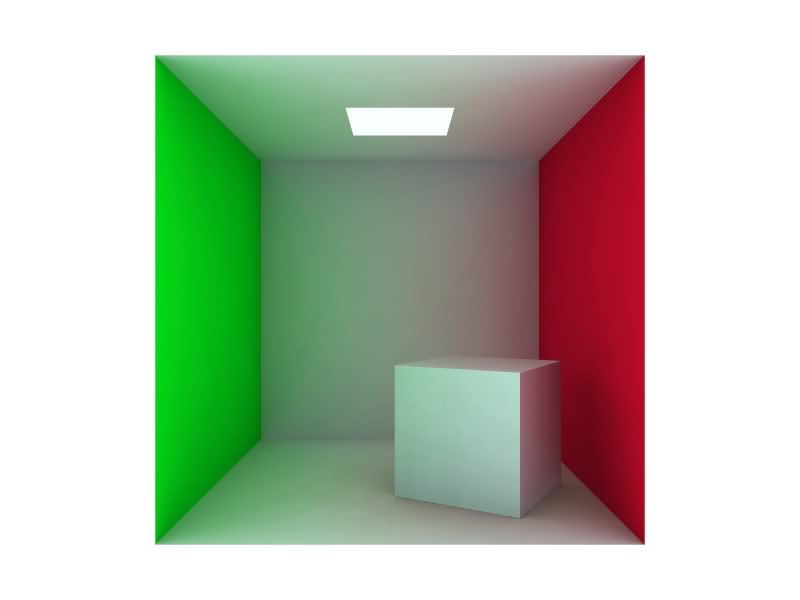
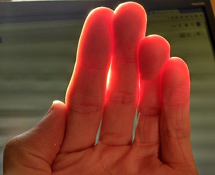

## 6 Reality check

###Can be rendered

|                |                      Black Plastic Ball                      |                         Chrome Ball                          |                          Jade Ball                           |
| :------------: | :----------------------------------------------------------: | :----------------------------------------------------------: | :----------------------------------------------------------: |
| **In reality** |  |  |  |
|  **Rendered**  |  |  |  |
|     $k_d$      |                       $0.01,0.01,0.01$                       |                        $0.4,0.4,0.4$                         |                       $0.54,0.89,0.63$                       |
|     $k_s$      |                       $0.50,0.50,0.50$                       |                       $0.77,0.77,0.77$                       |                       $0.32,0.32,0.32$                       |
|      $n$       |                            $32.0$                            |                            $16.8$                            |                            $12.8$                            |

###Cannot be realized

|                        Color Bleeding                        |                    Subsurface Scattering                     |
| :----------------------------------------------------------: | :----------------------------------------------------------: |
|  |  |

The effect of **color bleeding** cannot be rendered because our model doesn't consider the color of light reflected/refracted from one material to another.

Our model also cannot handle **subsurface scattering** which could be seen on some translucent materials, which light would reflect in the materials for sometimes before leaving the material but our model assume that light would leave the surface immediately when reflecting.